# Adding Input Controls

Unity's [Input System](https://docs.unity3d.com/Packages/com.unity.inputsystem@1.14/manual/index.html) enables you to add interactions to your scenes. You will use it to add input actions to the ball you created in ["Creating Basic 3D Objects"](./creating3DObjects.md). 

## Adding the Input System

Click menu: _Window > Package Manager_ then select _Packages: Unity Registry_ and select the _Input System_ package from the list, as per Figure 1, below. Click _Install_ (top right) and then _Yes_ on the warning message. Your Unity project will close and restart. That may take while, so be patient.

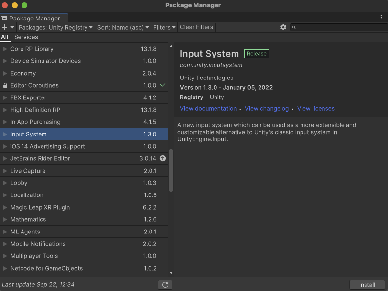

_Figure 1: Unity Input System_

Create another folder via the _Project_ view, and call it "Input", as per Figure 2.

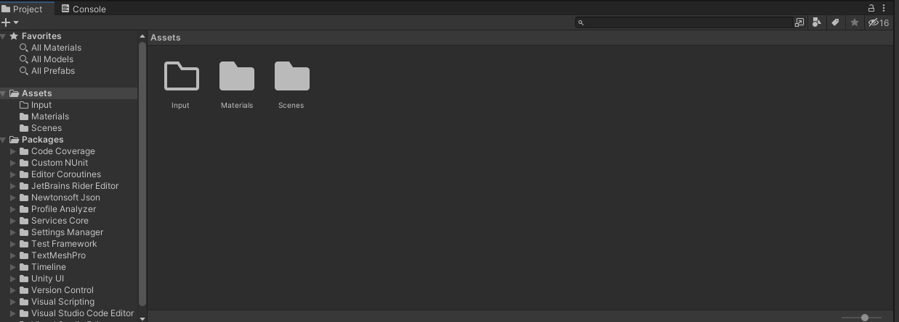

_Figure 2: Input folder_

## Create an Input Action

By default the icon is an outline, as the folder is currently empty. Double click the folder and then use the _Project_ create menu to create an _Input Action_. Call this "myControl", as per Figure 3.

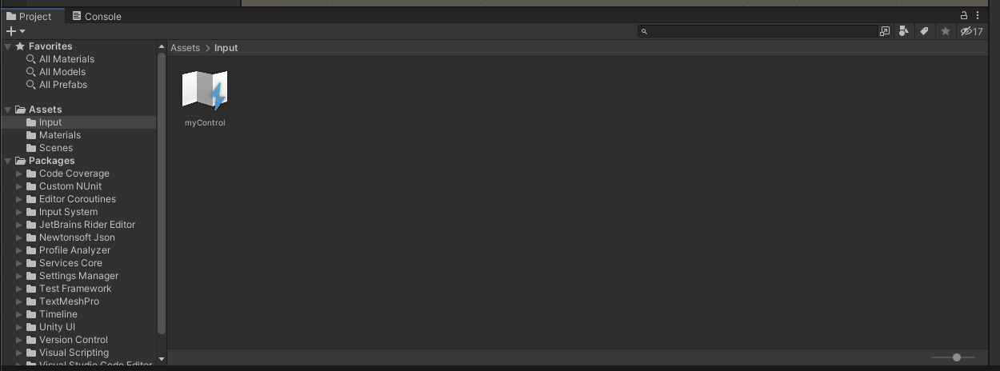

_Figure 3: myControl Input Action_

Double click on the myControl icon to open the _Input Actions_ dialog, as per Figure 4.

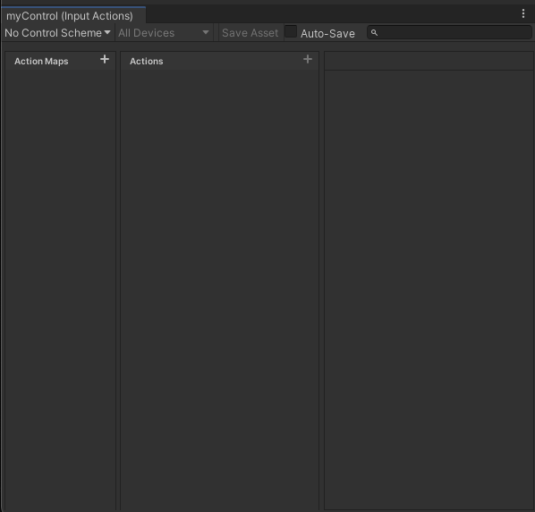

_Figure 4: Input actions dialogue_

Click on the + next to _Action Maps_ to create a new map and then rename the Action to "Jump", as per Figure 5.

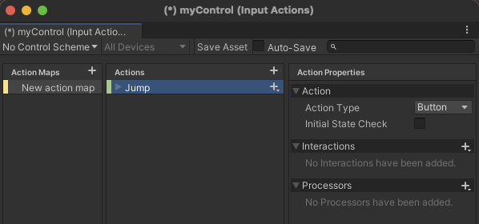

_Figure 5: Jump action_

This is the Jump action, but it needs assigning to some kind of control input action - use the spacebar. Click on the small down arrow next to the + sign for Jump and select _add binding_. Then click on the triangle to the right of Path and select _Keyboard_, as per Figure 6.

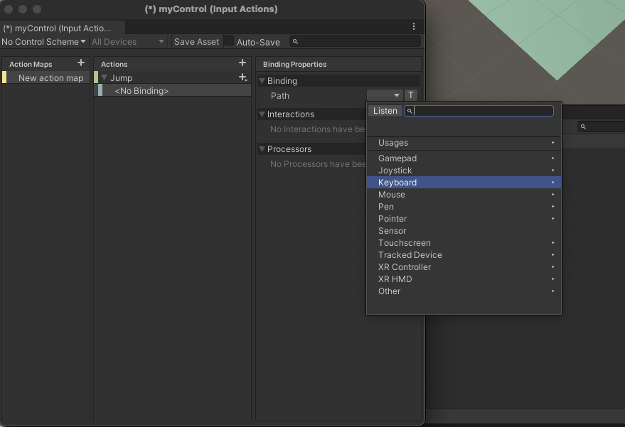

_Figure 6: Keyboard input action_

If you now click on the _Listen_ button, Unity will listen for an input, as per Figure 7. Hit the spacebar.

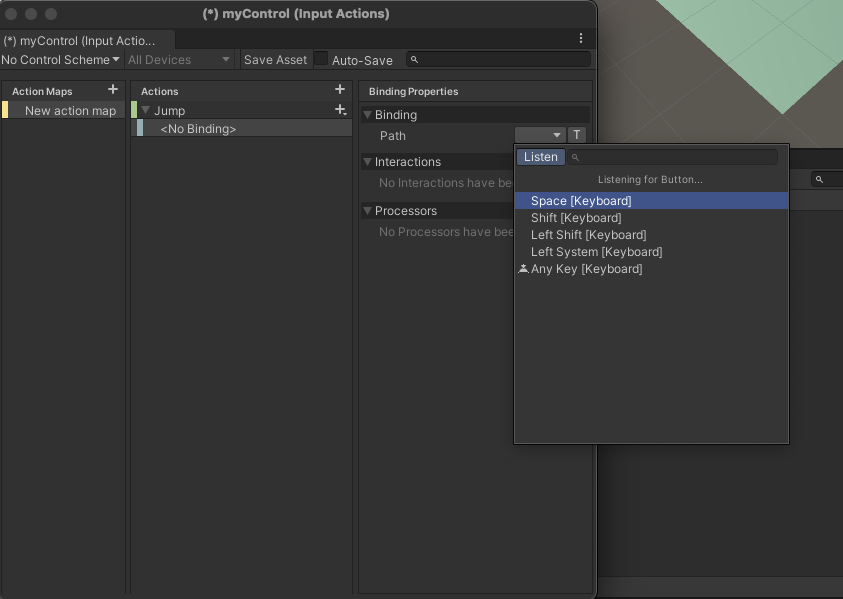

_Figure 7: Listen for spacebar_

Click on "Space [Keyboard]" and then save the asset by clicking the _Save Asset_ tab (above where you have named the action Jump in the window). That is the input action set up. 

### Add Input to the Ball

Now add the input action to the ball. Select the ball in the Hierarchy so that it appears in the inspector window and _add component_. Select _Input_, then _PlayerInput_. Drag the myControl action asset onto the Actions box in the _Player Input_ component, just like Figure 8.

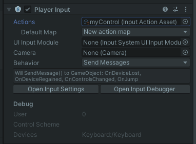

_Figure 8: Player input component_

## Scripting the Input Actions

To gain real control of _GameObjects_ in Unity, you need to do some [scripting](./supplimentary/scripting.md). Hence, you need to create a script to take control of the ball. 

Create a new script using the _add component_ button on the Ball object and call the script "myBall". Open the script by double clicking on the script in the assets folder. It should load in Visual Studio Code.  

Add the Input System to the code by adding the following line at the top of your script:

`using UnityEngine.InputSystem;`

By default, Input Actions invoke methods using this pattern:

`public void On[Action Name Goes Here]()`

Hence, the _Jump_ Input Action will invoke a method called `OnJump()`. Imagine you created an _Attack_ action, that would invoke `OnAttack()`.

Add the following method below your Update method:

```csharp
void OnJump() 
{ 
    Debug.Log("Jump Pressed");          
} 
```

The `Debug.Log` command checks if the Jump action is working; if it is, it outputs the words "Jump Pressed" to the _Console_ window.

Save the script and run the project. When you push the space bar you should see "Jump Pressed" in the Console window, as per Figure 9:

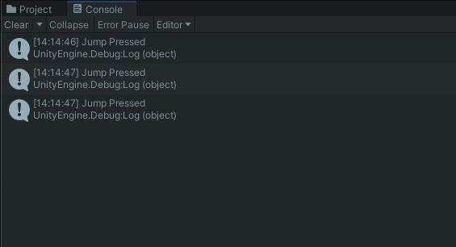

_Figure 9: Jump Pressed console output_

Ultimately, you will get the ball to jump, but do something simpler, first. Below the `Debug` line, add the following code: 

`GetComponent<Renderer>().material.color = Color.blue;`

Save the script and _play_. The line above assigns the colour blue to the material of the _GameObject_ to which the script is attached. So your ball should turn blue. 

Now make the ball actually jump. Although you can use `transform.Translate` and `transform.Rotate` to move _GameObjects_, in this instance it is better to employ the Unity physics engine because you will be applying a _force_ to the ball. In Unity, you apply forces to a _RigidBody_, which has already been added the ball. So, the general idea of the script is to add a reference to that `Rigidbody` and then apply a force to that. To do so, add the following line after the opening `{` of the "myBall" class:

`private Rigidbody rb;`

Then assign the _Rigidbody_ component to the `rb` variable in the `Start()` method. which is called when the scene first loads:

`rb = GetComponent<Rigidbody>();`

Finally, now `rb` is associated with the _RigidBody_ of the ball _GameObject_, a force can be applied to it to get it to move. To do so, add the following code to the `OnJump()` method:

`rb.AddForce(0.0f, 300.0f, 0.0f);`

`AddForce` applies a force continuously along the direction of the force [vector](./vectors.md). In this case it is a vector3 with x,y,z component values, where y is the up direction in the scene. So, that has the value 300 with the x and z vectors zero; in other words, that line applies a force of '300' upwards. Your script should look like this:

```csharp
using System.Collections; 
using System.Collections.Generic; 
using UnityEngine; 

using UnityEngine.InputSystem; 

public class myBall : MonoBehaviour 
{ 
    private Rigidbody rb; 

    // Start is called before the first frame update 
    void Start() 
    { 
        rb = GetComponent<Rigidbody>(); 
    } 

    // Update is called once per frame 
    void Update() 
    { 
         
    } 

    void OnJump() 
    { 
        Debug.Log("Jump Pressed"); 
        GetComponent<Renderer>().material.color = Color.blue; 
        rb.AddForce(0.0f, 300.0f, 0.0f); 
    } 
}
```

Save the script and then play the scene and the ball should turn blue and jump when you press the space bar, just like Figure 10. 

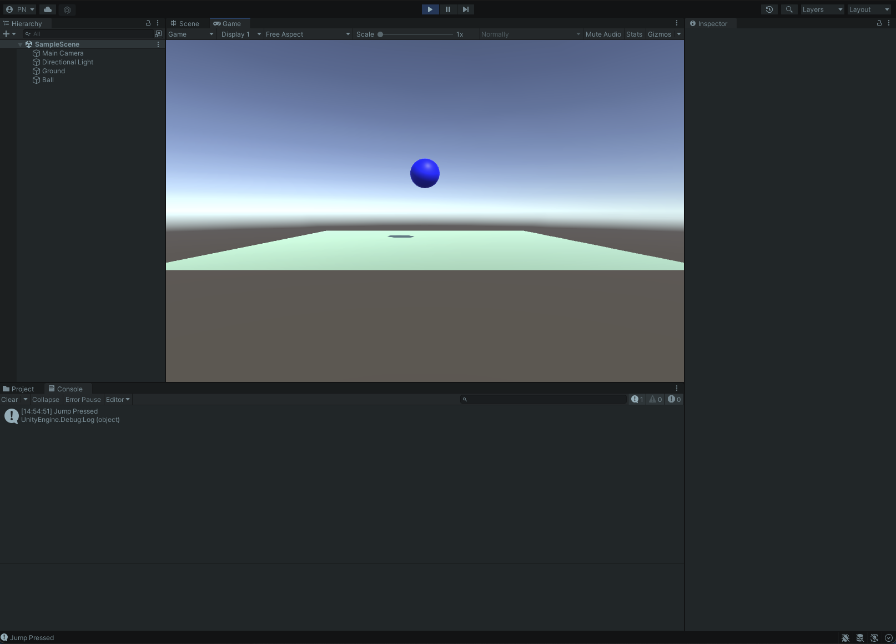

_Figure 10: The blue jumping ball_

However, it is bad practice to litter your code with _magic numbers_ (again, go and do some research on _magic numbers_ in code). Much better is to assign the numbers to a variable and then use the variable. Furthermore, in Unity, if you serialise the variable, it will be available in the _Inspector_ and the value can be changed there. That has many benefits and those are left as an exercise for you to research. So, create a variable and use that in place of the `300.0f` value in the AddForce method above. Here's the finished script:

```csharp
using System.Collections;
using System.Collections.Generic;
using UnityEngine;

using UnityEngine.InputSystem;

public class myBall : MonoBehaviour
{

    [SerializeField] private float jumpFactor = 300.0f;
    private Rigidbody rb;

    // Start is called before the first frame update
    void Start()
    {
        rb = GetComponent<Rigidbody>();
    }

    // Update is called once per frame
    void Update()
    {
        
    }

    void OnJump() 
    { 
        Debug.Log("Jump Pressed"); 
        GetComponent<Renderer>().material.color = Color.blue;
        rb.AddForce(0.0f, jumpFactor, 0.0f);
    } 
}
```

Again, it is a good idea to keep your project well organised, so in the _Project_ view, create a folder called "Scripts". Drag your "myBall" script into that folder, then, since you've made substantial changes, save the project.

## Adding Additional Input Actions

The ball should do more than jump; it should also move left, right, forward and back, using the arrow keys on the keyboard. 

However, for those actions to make sense, you should first orient the scene so that the _x_ axis points left and the z axis points back. Additionally, you should align the _Main Camera_ to that same view via _GameObject > Align to View_. Your _Scene_ view should look somewhat similar to that shown in Figure 11 below.

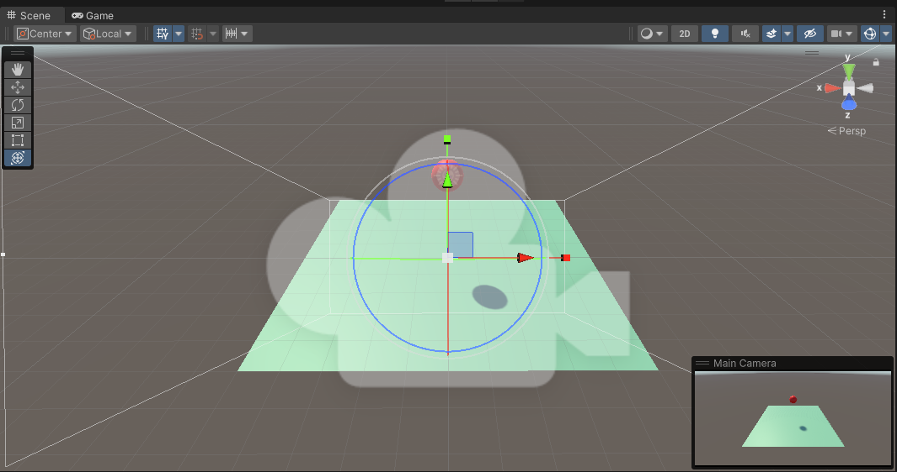

_Figure 11: Scene view with the x axis left, z axis back, and the main camera aligned with the view_

To enable the new actions, follow the same method as you did for the jump input action above. 

So, to create a _left_ action, double click on the myControl icon to open the Input Actions dialog, then click on the + next to Action to create a new action below "Jump" and rename it "Left". Then click on the small down arrow next to the + sign for Left and select add binding. Then click on the triangle to the right of Path and select Keyboard. If you now click on the _Listen_ button, Unity will listen for an input. Hit the left arrow key. Do the same for right, forward and back. Afterwards, _Save Asset_. You should have a action map that looks like Figure 12.

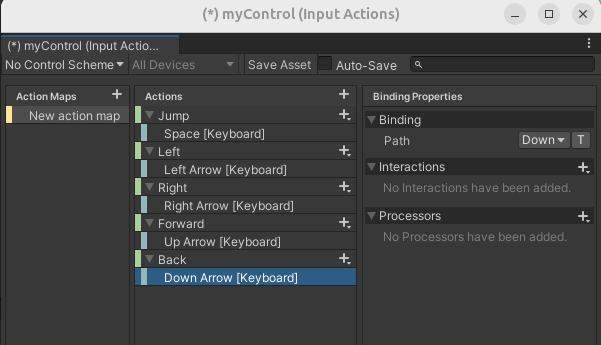

_Figure 12: Left, Right, Forward Back Input Actions_

## Scripting the Additional Input Actions

The input actions above will invoke `OnLeft`, `OnRight`, `OnForward` and `OnBack`, so add those to your "myBall" script and check that the actions are being called by adding a `Debug.Log` command within each method. The script should look similar to that below, and if all is well, when you press _play_ in the _Toolbar_ and press the arrow keys, you should see the corresponding messages in the _Console_.

```csharp
using System.Collections;
using System.Collections.Generic;
using UnityEngine;

using UnityEngine.InputSystem;

public class myBall : MonoBehaviour
{

    [SerializeField] private float jumpFactor = 300.0f;
    private Rigidbody rb;


    // Start is called before the first frame update
    void Start()
    {
        rb = GetComponent<Rigidbody>();
    }

    // Update is called once per frame
    void Update()
    {
        
    }

    void OnJump() 
    { 
        Debug.Log("Jump Pressed"); 
        GetComponent<Renderer>().material.color = Color.blue;
        rb.AddForce(0.0f, jumpFactor, 0.0f);
    } 

    void OnLeft() 
    { 
        Debug.Log("Left Pressed"); 
    } 

    void OnRight() 
    { 
        Debug.Log("Right Pressed"); 
    } 

    void OnForward() 
    { 
        Debug.Log("Forward Pressed"); 
    } 

    void OnBack() 
    { 
        Debug.Log("Back Pressed"); 
    } 
}
```

Now it's just a matter of adding the right forces in the right directions. So, for left and right, you need forces applied to the x axis, and for forward and back, forces applied to the z axis. Furthermore, if you oriented the scene as per Figure 11, then for left, you should apply a positive factor in the x component of the `AddForce` method, and for right, apply a negative factor in the x component. Similarly, for forward, apply a negative factor in the z component, and for back, apply a positive factor. Below is the completed script with requisite variables and all `Debug` messages removed (they're no longer required as you know the calls work). Additionally, the change of material colour has been removed, and the `Update` method has been deleted, as it is not required here..

```csharp
using System.Collections;
using System.Collections.Generic;
using UnityEngine;

using UnityEngine.InputSystem;

public class myBall : MonoBehaviour
{

    [SerializeField] private float jumpFactor = 300.0f;
    [SerializeField] private float sideFactor = 300.0f;
    [SerializeField] private float backFactor = 300.0f;
    private Rigidbody rb;


    // Start is called before the first frame update
    void Start()
    {
        rb = GetComponent<Rigidbody>();
    }

    void OnJump() 
    { 
        rb.AddForce(0.0f, jumpFactor, 0.0f);
    } 

    void OnLeft() 
    { 
        rb.AddForce(sideFactor, 0.0f, 0.0f);
    } 

    void OnRight() 
    { 
        rb.AddForce(-sideFactor, 0.0f, 0.0f);
    } 

    void OnForward() 
    {       
        rb.AddForce(0.0f, 0.0f, -backFactor);
    } 

    void OnBack() 
    {    
        rb.AddForce(0.0f, 0.0f, backFactor); 
    } 
}
```

You should now have full control of the ball and there's the basis for a [simple game](./creatingTheGame.md). 

You've made substantial changes, so save the project.

## External Links

- You might wish to complete lessons 1.1 to 1.4 of [Unity 1 - Player control](https://learn.unity.com/project/unit-1-driving-simulation?missionId=5f71fe63edbc2a00200e9de0&pathwayId=5f7e17e1edbc2a5ec21a20af&contentId=5f7229b2edbc2a001f834db7).