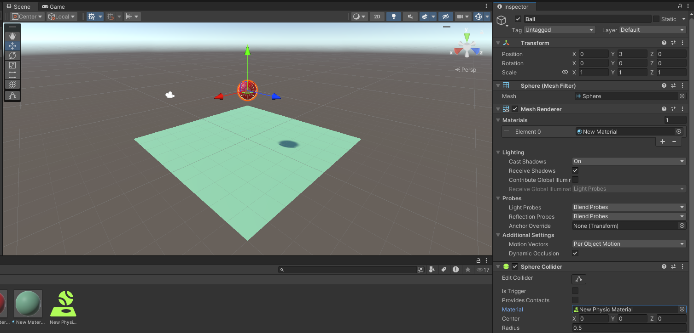

# Adding Input Controls

Now you will use Unity's [Input System](https://docs.unity3d.com/Packages/com.unity.inputsystem@1.14/manual/index.html) to add interactions to _GameObjects_.

Delete the cube you [created](./creating3DObjects.md). Rename the plane "ground", and the sphere "ball".Reset the ground's transform so it's rotation values are all zero. You should have something that looks similar to Figure 1, below.


_Figure 1: Ground and ball_

Add a _RigidBody_ to your ball. When you press play the ball should drop on to the ground and stop.

## Add a Physics Material

In the _Project_ view, click the create menu and select _Physic Material_. Set the _Bounciness_ of the material to 1, then drag the _Physic Material_ onto the ball. You should see the _Physic Material_ assigned to the Material property of the ball's Sphere Collider in the _Inspector_, as per Figure 2. Press play, and your ball should bounce.



_Figure 2: Ball Physics Material_

It is a good idea to keep your project well organised, so in the _Project_ view, click the create menu and create a _Folder_ called _Materials_. Drag your materials into that folder.

## Adding the Input System

Now use the Unity Input System to add input interactions to the ball. Click menu: Window > Package Manager then Select "Packages: Unity Registry" and then "Input System" package from the list, as per Figure 3, below. Click _Install_ (top right) and then "Yes" on the warning message. Your Unity project will close and restart.


_Figure 3: Unity Input System_

Create an another folder via the _Project_ view, and call it "Input", as per Figure 4.


_Figure 4: Input folder_

By default the icon is an outline as the folder is currently empty. Double click the folder and then use the Project create Menu to create an "Input Actions" and call this myControl, as per Figure 5.


_Figure 5: myControl Input Action_

Double click on the myControl icon to open the input actions dialog, as per Figure 6.


_Figure 6: Input actions dialogue_

Click on the + next to Action Maps to create a new map and then rename the Action to "Jump", as per Figure 7.


_Figure 7: Jump action_

This is the Jump action, but we need to assign it to some kind of control input action - let's use the spacebar. Click on the small down arrow next to the + sign for Jump and select "add binding". Then click on the triangle to the right of Path and select "Keyboard", as per Figure 8.


_Figure 8: Keyboard input action_

If you now click on the "Listen" button Unity will listen for an input, as per Figure 9. Hit the space bar.


_Figure 9: Listen for spacebar_

Click on "Space [Keyboard]" and then save the asset by clicking the "Save Asset" tab (above where you have named the action Jump in the window). That is the input action set up. 

## Add Input to the Ball

Now, you should add the input action to the ball. Select the ball in the Hierarchy so that it appears in the inspector window and "add component". Select "Input" then "PlayerInput". Drag the myControl action asset on to the Actions box in the Player Input component, just like Figure 10.


_Figure 10: Player input component_

## Scripting the Input System

Now, you need to create a script to make the ball do something. You should launch Visual Studio Code so that you're ready to write the script.  

Now go back to Unity and create a new script using the add component button on the Ball object and call it "myBall". Open the script by double clicking on the script in the assets folder. It should load in Visual Studio Code.  

Add the Input System by adding the following line at the top of your script:

`using UnityEngine.InputSystem;`

By default you have already created a method that is called when we hit the space bar called `OnJump()`. You associated this method with the Jump action by using this pattern to name it:

`public void On[Action Name Goes Here]().`

For example, the Jump Action invokes `OnJump()`, while the Attack action invokes `OnAttack()`.

Add the following method below your Update method:

```csharp
void OnJump() 
{ 
    Debug.Log("Jump Pressed");          
} 
```

You have added the Debug command here to check if the Jump action is working. This outputs the words "Jump Pressed" to the Console window.

Save the script and run the project. When you push the space bar you should see "Jump Pressed" in the Console window, as per Figure 11:


_Figure 11: Jump Pressed console output_

Ultimately we are going to get the ball to jump, but let's do something simpler first. Below the Debug line add the code: 

`GetComponent<Renderer>().material.color = Color.blue;`

Save the script and play. This line assigns the colour blue to the _GameObject material_ to which the script is attached. So your ball should turn blue. 

Now you need to make the ball actually jump. In the [Unity 1 - Player control](https://learn.unity.com/project/unit-1-driving-simulation?missionId=5f71fe63edbc2a00200e9de0&pathwayId=5f7e17e1edbc2a5ec21a20af&contentId=5f7229b2edbc2a001f834db7) tutorial, a `transform.Translate` and `transform.Rotate` were used to move the _GameObject_. This is straightforward, but not always ideal - instead, you should use _forces_ so that you deploy the Unity physics engine. In Unity, you apply forces to a _RigidBody_. We already have a _RigidBody_ added to our ball, so let's add a reference to that in the script. Add the following line after the opening `{` for the myBall class:

`private Rigidbody rb;`

Now you need to assign the _Rigidbody_ component to the `rb` variable. In the `Start()` method add the following:

`rb = GetComponent<Rigidbody>();`

`rb` is now associated with the _RigidBody_ of the ball _GameObject_. You can now apply a force to it to get it to move. Add the following code to your OnJump() method:

`rb.AddForce(0.0f, 300.0f, 0.0f);`

`AddForce` applies a force continuously along the direction of the force [vector](./vectors.md). In this case it is a vector3 with x,y,z vector values. Y is the up direction in our scene so that has the value 300 with the x and z vectors zero. Your script should look like this:

```csharp
using System.Collections; 
using System.Collections.Generic; 
using UnityEngine; 

using UnityEngine.InputSystem; 

public class myBall : MonoBehaviour 
{ 
    private Rigidbody rb; 

    // Start is called before the first frame update 
    void Start() 
    { 
        rb = GetComponent<Rigidbody>(); 
    } 

    // Update is called once per frame 
    void Update() 
    { 
         
    } 

    void OnJump() 
    { 
        Debug.Log("Jump Pressed"); 
        GetComponent<Renderer>().material.color = Color.blue; 
        rb.AddForce(0.0f, 300.0f, 0.0f); 
    } 
}
```

Save the script and then play the scene and the ball should turn blue and jump when you press the space bar, just like Figure 12. 


_Figure 12: The blue jumping ball_

Finally, it is bad practice to litter your code with _magic numbers_. Much better is to assign the numbers to a variable and then use the variable. Furthermore, in Unity, if you serialise the variable, it will be available in the Inspector and the value can be changed there. Hence, you should create a variable and use that in place of the `300.0f` value in the AddForce method above. Here's the finished script:

```csharp
using System.Collections;
using System.Collections.Generic;
using UnityEngine;

using UnityEngine.InputSystem;

public class myBall : MonoBehaviour
{

    [SerializeField] private float jumpFactor = 300.0f;
    private Rigidbody rb;

    // Start is called before the first frame update
    void Start()
    {
        rb = GetComponent<Rigidbody>();
    }

    // Update is called once per frame
    void Update()
    {
        
    }

    void OnJump() 
    { 
        Debug.Log("Jump Pressed"); 
        GetComponent<Renderer>().material.color = Color.blue;
        rb.AddForce(0.0f, jumpFactor, 0.0f);
    } 
}
```

## Links

- The [Unity Roll-a-ball tutorial](https://learn.unity.com/tutorial/setting-up-the-game?uv=2020.2&projectId=5f158f1bedbc2a0020e51f0d) is a nice introduction in how to move rigidbodies in a simple game. If you want to do that, create a 3D Core project and call it  "Rollaball" like you did with "JumpUp" above. Now follow the Roll-a-Ball tutorial.
- You might wish to complete lessons 1.1 to 1.4 of [Unity 1 - Player control](https://learn.unity.com/project/unit-1-driving-simulation?missionId=5f71fe63edbc2a00200e9de0&pathwayId=5f7e17e1edbc2a5ec21a20af&contentId=5f7229b2edbc2a001f834db7).
