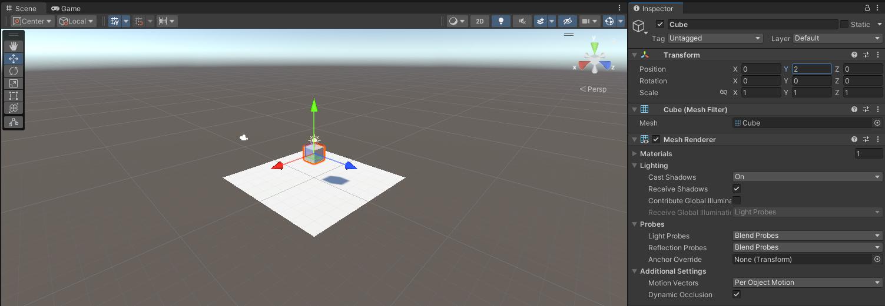
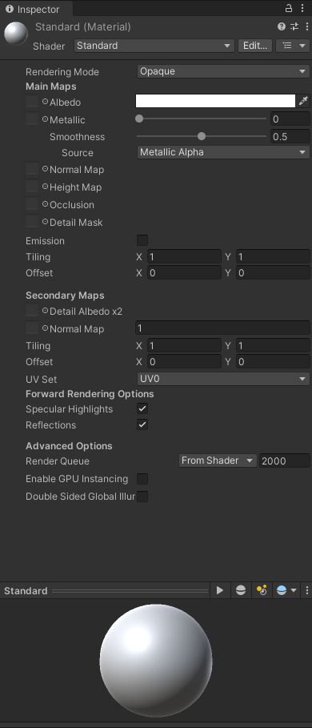
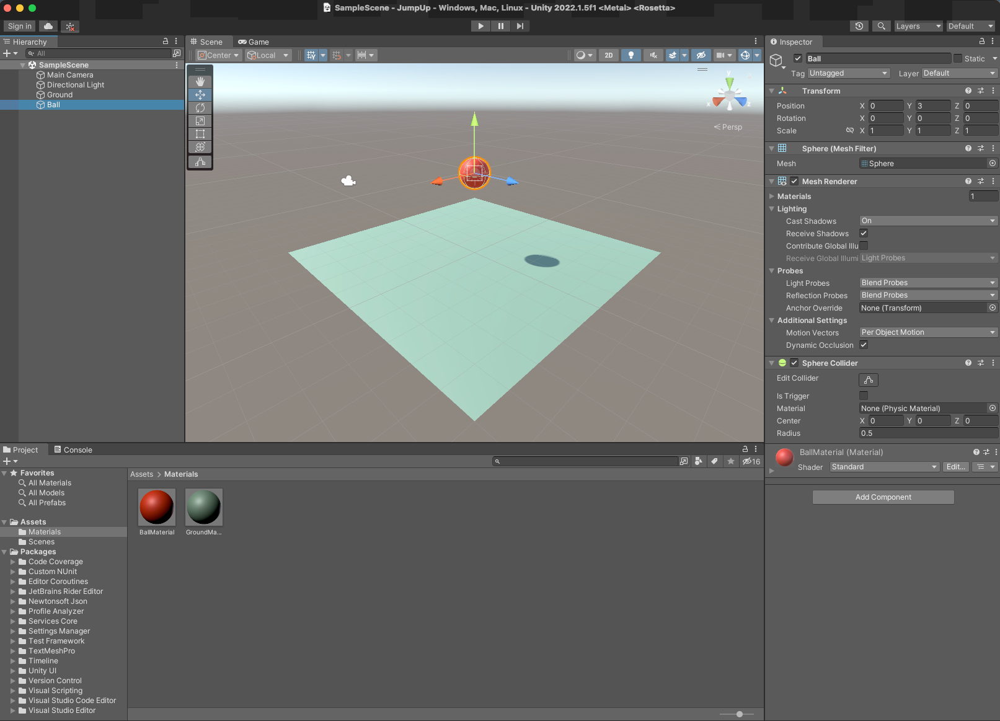
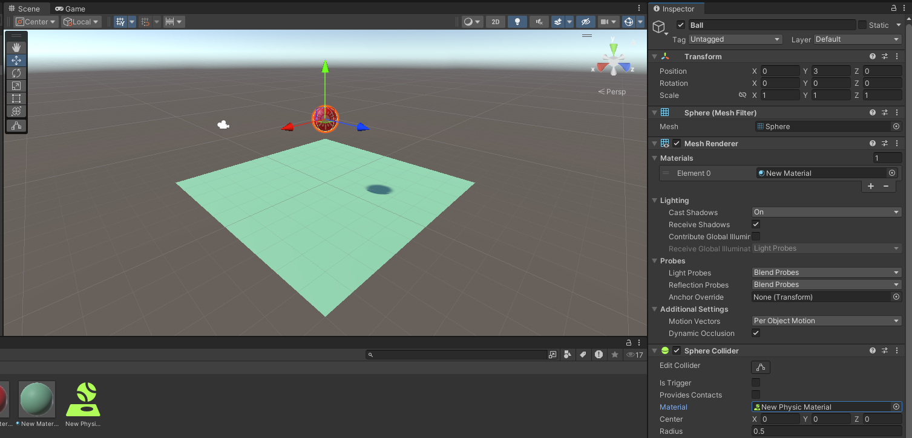

# Creating Basic 3D Objects

_GameObjects_ are the basic building blocks of any Unity scene.

## Creating GameObjects

Using the Hierarchy window's _create_ tab (available via a right click), select _3D Object - Plane_. You should get something like Figure 1, below.

_Figure 1: A plane_

This plane is a _GameObject_ and should appear as the object _Plane_ in your Hierarchy view, as per Figure 2.

_Figure 2: Plane in the Hierarchy_

Now use the same method to put another of Unity's basic _GameObjects_ on the _plane_ - a _cube_. You should get something like Figure 3:

_Figure 3: A cube_

At this point, you have a white cube embedded in a white plane, because both the cube and the plane have the same origin. Select the cube in the Hierarchy menu and you can see its position in the _Transform_ component in the Inspector window. Change the Y position to 2. It should now float above the plane, just like Figure 4.

_Figure 4: A cube above a plane_

### Adding Materials

To add some colour to the cube we need to add a [material](./supplimentary/materials.md). In the Project view, click the create menu and select _Material_. A grey sphere should appear at the bottom of your Inspector view, just like Figure 5.

_Figure 5: New material_

Towards the top of the Inspector window is a colour chooser next to the word _Albedo_, which is the property that controls the base color and transparency of the material. Click on the white rectangle and choose a bright red colour (RGB, 255,0,0), as per Figure 6. You should now see a red sphere called _New Material_ in the assets folder in the project view. Drag this material onto the cube in the Scene view.

_Figure 6: Apply material_

Save your scene - _File > Save_.

## Add Physics

Now choose _play_ in the _Toolbar_, and the running game will appear. 

The cube just floats above the plane because, currently, there are no forces acting on the scene so nothing will move. Click on the play button again to exit game view. 

To make _GameObjects_ move in Unity, you need to add some [physics](./supplimentary/3DPhysics.md).

Add a _Rigidbody_ component to your cube (in the _Inspector_, add _component_, _physics_, _rigidbody_).

Now push _play_ and the cube will drop under the influence of gravity (until it hits the plane). Play around with the following component options:

1. Turn off the BoxCollider on the cube or the MeshCollider on the plane. What happened and why?

2. Re-enable the BoxCollider on the cube and try tilting the plane by setting the plane's x and z rotation values to 2. The friction in the _Rigidbody_ will stop the cube from sliding. What happens if you exit play then set the values to 20 rather than 2? Has your plane disappeared? At this point, you may wish to go and research _Backface Culling_. Play around with the values and make the plane reappear.

3. Delete the cube and add a sphere with a y transform of 3. Now the sphere should hit the plane and roll off.

4. Try adding a cube that the sphere will hit to deflect its movement. Note you can change the dimension of the cube to make it easier to hit.

If you've followed everything above, you should have something somewhat similar to Figure 7 (all the objects have had coloured matertials added to make them easier to see). 

_Figure 7: Coloured objects_ 

However, you won't be needing the cube, so delete it (there are numerous ways to do that - quite how is left to you to figure out). Then, rename the plane "ground", and the sphere "ball". Finally, reset the ground's transform so it's rotation values are all zero; you should have something that looks similar to Figure 8, below.

_Figure 8: Ground and ball_

Add a _RigidBody_ to your ball. When you press play the ball should drop on to the ground and stop.

### Add a Physics Material

In the _Project_ view, right click and select _create > Physic Material_. Set the _Bounciness_ of the material to 1, then drag the _Physic Material_ onto the ball. You should see the _Physic Material_ assigned to the _Material_ property of the ball's Sphere Collider in the _Inspector_, as per Figure 9. Press play, and your ball should bounce.

_Figure 9: Ball Physics Material_

It is a good idea to keep your project well organised, so in the _Project_ view, right click, _create > Folder_, and call it "Materials". Drag your materials into that folder.

Finally, save your project.
