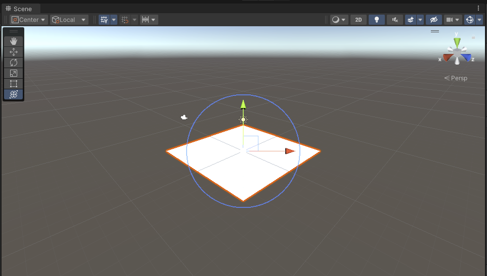
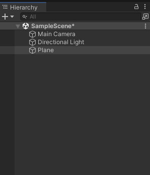
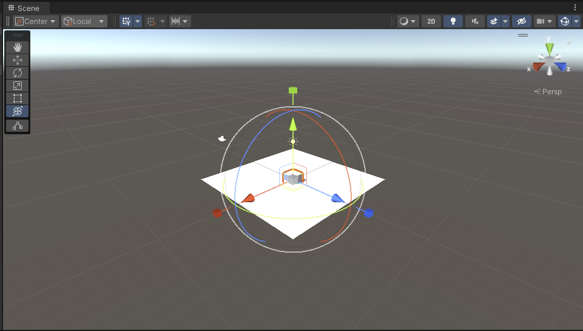
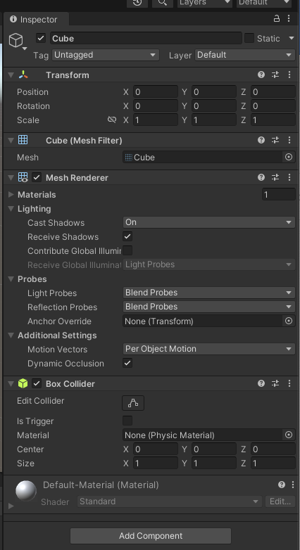
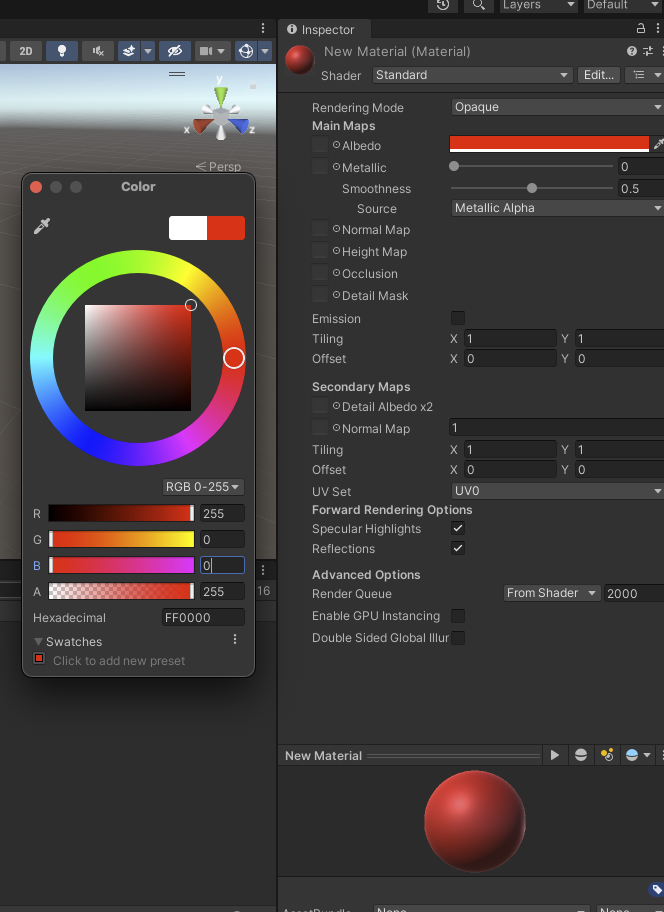
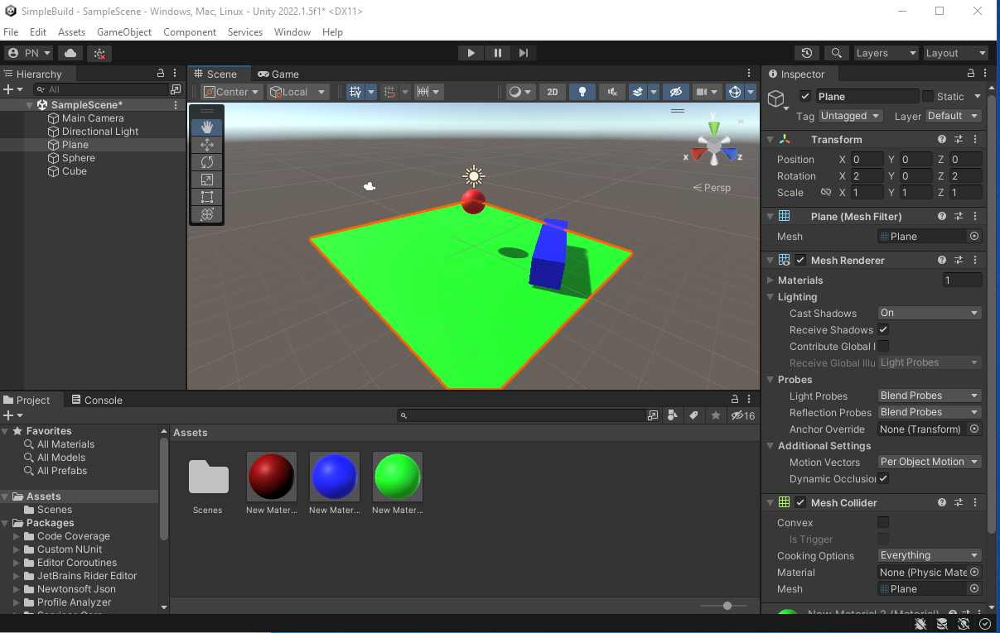

# Creating Basic 3D Objects

_GameObjects_ are the basic building blocks of any Unity scene.

## Creating GameObjects

Use the Hierarchy window's _create_ tab (available via a right click), select _3D Object - Plane_. You should get something like Figure 1, below.

_Figure 1: A plane_

This plane is a _GameObject_ and should appear as the object _Plane_ in your Hierarchy view.

Now use the same method to put another of Unity's basic _GameObjects_ on the _plane_ - a _cube_. You should get something like Figure 2:

_Figure 2: A cube_

At this point, you should have a white cube embedded in a white plane, which is not ideal. Both the cube and the plane have the same origin. Select the cube in the Hierarchy menuand you can see its position in the _Transform_ component in the Inspector window.

Change the Y position to 2. It should now float above the plane, just like Figure 3.

_Figure 3: A cube and a plane_

### Adding Materials

To add some colour to the cube we need to add a material. In the Project view, click the create menu and select _Material_. A grey sphere should appear at the bottom of your Inspector view, just like Figure 4.

_Figure 4: New material_

 Towards the top of the Inspector window is a colour chooser (white rectangle) next to the word _Albedo_. Click on the rectangle and choose a bright red colour (RGB, 255,0,0). You should also see a red sphere called _New Material_ in the assets folder in the project view, as shown in Fugure 5. Drag this red sphere on to the cube in the Scene view.

_Figure 5: Apply material_

Save your scene - File - Save.

## View Controls

Now there is something to look at, you can play with _Mesh Renderer_ in the _Inspector_, which makes the Object visible. Try unticking the check box.

## Add Physics

Now choose _play_ in the _toolbar_, and the game view should appear. However, the cube just floats above the plane because, currently, there are no forces acting on the scene so nothing will move. Click on the play button again to exit game view. Add a _Rigidbody_ component to your cube (in the _Inspector_ add component, physics, rigidbody).

Now push play and the cube will drop under the influence of gravity util it hits the plane. Play around with the following component options:

1. Turn off the BoxCollider on the cube or the MeshCollider on the plane. What do you think will happen?

2. Try tilting the plane (with the colliders on) by setting the plane's x and z rotation values to 2. The friction in the _Rigidbody_ should stop the cube from sliding. What happens if you set the values to 20 rather than 2? Has your plane disappeared? If it has, why?

3. Delete the cube and add a sphere in the same position instead. Now the sphere should hit the plane and roll off.

4. Try adding a cube that the sphere will hit to deflect its movement. Note you can change the dimension of the cube to make it easier to hit.

If you've followed everything above, you should have something like Figure 6 (the objects have been coloured to make them easier to see).

_Figure 6: Coloured objects_ 

