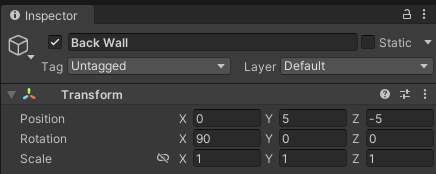
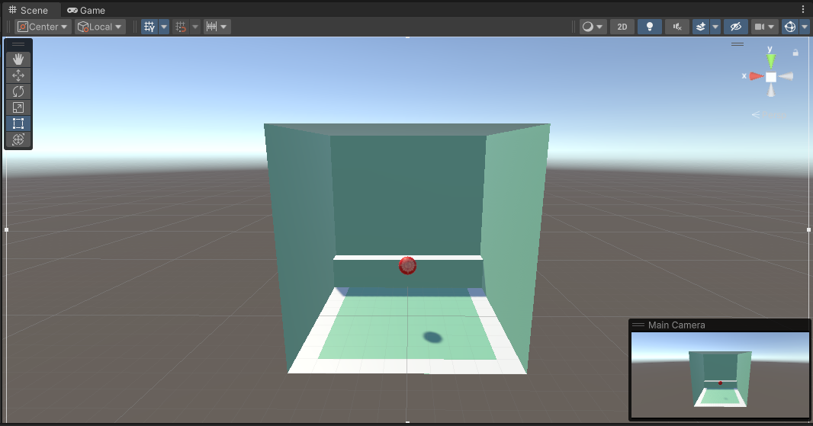

# Creating the Game

Now that you've [got used to the Unity editor](./editorOverview.md), [created some basic 3D objects](./creating3DObjects.md) and [added some input controls](./addingInputControls.md), it's time to turn the scene into a game.

The game you are going to create is very simple. It will feature an enclosed arena containing four zones (left, right, front and back), which your ball must enter as quickly as possible.

## Model the Game Arena

To model the walls and roof of the game arena, you are going to make copies of the existing ground and then _transform_ those copies so they are in the correct position. 

So, in the _Hierarchy_, right-click on "Ground" and select _copy_. Then, right-click again in the  _Hierarchy_, and select _paste_ - you will have a new _GameObject_, named "Ground (1)". Right-click on that, select _Rename_, and call it "Left Wall". Now, you need to position it so it does indeed become the left wall. The easiest way to do that is to type in values directly into the _GameObject's Transform_ in the inspector; the x and y positions should be 5, and the z rotation should be 90 degrees, just like Figure 1.  


_Figure 1: Left wall transform_

Next, repeat the process for the right wall. However, this time, the x position should be -5 and the y position should be 5. The z rotation should be -90 degrees, just like Figure 2.


_Figure 2: Right wall transform_

Then, repeat the process for the back wall. However, this time, the y position should be 5 and the z position should be -5. The x rotation should be 90 degrees, just like Figure 3.



_Figure 3: Back wall transform_

Next, the front wall. Here, you are going to take advantage of [back face culling](https://en.wikipedia.org/wiki/Back-face_culling), whereby, to preserve processing cycles, Unity will only render one side of a _GameObject_. Hence, if the wall is positioned so that the rendered side looks inward, the player will be able to see into the arena, but the ball will still rebound off the wall. To take advantage of this, the y and z positions should be 5 and the x rotation should be -90 degrees, just like Figure 4.


_Figure 4: Front wall transform_

All that remains is to repeat the process for the roof of the arena. this time, the y position should be 10 and the x rotation should be 180 degrees, just like Figure 5.


_Figure 5: Roof transform_

Now position everything so that the player is looking directly into the arena, and align the main camera with that view. 

At this point, the _Hierarchy_ is beginning to look a little unorganised, so, just as you have done for the _Project_, you should tidy up. To do so, click on your first wall in the hierarchy, then shift-click on the last wall to highlight all four walls. Then right-click > _Create Empty parent_ and call it "Walls". Next, highlights "Ground", "Roof" and "Walls", right-click > _Create Empty Parent_ and call it "Arena". 

All being well, you will have a _Hierarchy and _scene_ that looks something like Figure 6, below:


_Figure 6: Arena walls_

Now, if you press _play_ in the _Toolbar_, you should be able to move the ball using the spacebar and arrow keys and it should be impossible for the ball to escape the arena.

## Add Some Trigger Zones

To turn the arena into a game, you're going to create some trigger zones for the ball to move into, then use some more of Unity's [physics engine](./supplimentary/3DPhysics.md), via _Triggers_, to keep a track of which zones the ball enters.

First, create the front trigger zone using a _plane GameObject_. Name the object "Front Trigger", and make its transform look like that of Figure 7.


_Figure 7: Front trigger transform_

The idea here is to make the trigger zone a thin strip (its z scale is 0.1), position it at the front of the arena (its z position is 4.5) and move it so it is just off the floor (its y position is 0.001 - if you left this with a y position of zero, you might experience a phenomenon called [Z-fighting](https://en.wikipedia.org/wiki/Z-fighting), a flickering effect that happens when two or more objects are fighting to be rendered at the same position). 

Also, select the _Convex_ and _Is Trigger_ options of the "Front Triggger" Mesh Collider component in the _Inspector_, as per Figure 8.


_Figure 8: Convex trigger_

A collider that's marked as a trigger detects other colliders (but will not trigger collisions themselves). To handle the detection, you use an `OnTrigger` method in a script. So, in the scripts folder in the _Projects_ window, right click > _create > C# Script_ and call it "zones". Then drag the script onto the "Front Trigger" in the hierarchy. Finally, double click on the script to open it in Visual Studio Code. Now, add an `OnTrigger` method, and use the `Debug.Log` trick to check that the trigger is firing whenever the ball collides with it:

```csharp
void OnTriggerEnter(Collider other)
{
    Debug.Log("In Trigger");
}
```

Save the script and return to Unity - if you've written the script correctly, when you _play_ and the ball collides with "Front Trigger", you should see "In Trigger" in the console window. If you do not see that, first check that you did not have any compilation errors. If not, then check that the script is attached as a component via the "Front Trigger" inspector. 

Next, create the left trigger zone similar to how you created the walls of the arena; copy the front trigger zone in the _Hierarchy_, rename it "Left Trigger", then make its transform look like Figure 9.


_Figure 9: Left trigger transform_

For the right trigger zone, copy the front or left trigger zones in the _Hierarchy_, rename it "Right Trigger", then make its transform look like Figure 10.


_Figure 10: Right trigger transform_

The back trigger is going to go on a stand (so the player has to use the jump interaction to activate the trigger). So, in the hierarchy, right-click > _3D Object > Cube_. Name it "Back Stand". Drag the green material onto it (to differentiate it from the trigger zones). Then make its transform look like that of Figure 11.


_Figure 11: Back stand transform_

Now, For the back trigger zone, copy the front, left or right trigger zones in the _Hierarchy_, rename it "Back Trigger", then make its transform look like Figure 12. The idea here is to place the trigger on the stand you just created above. 


_Figure 12: Back trigger transform_

You should organise the hierarchy to remove the clutter of the trigger zones. Something like Figure 13 would do that.


_Figure 13: Arena hierarchy_

Finaly, your scene should look something similar to that in Figure 14, below.



_Figure 14: Arena scene_

Now, if you press _play_ in the _Toolbar_, you should see "In Trigger" in the console window whenever the ball collides with the front, back, left or right trigger zones. 

## Set Up the Game Controls


## Create the User Output


## Run the Game


## External Links

- [Back Face Culling](https://en.wikipedia.org/wiki/Back-face_culling)
- [Z-fighting](https://en.wikipedia.org/wiki/Z-fighting)
- The [Unity Roll-a-ball tutorial](https://learn.unity.com/tutorial/setting-up-the-game?uv=2020.2&projectId=5f158f1bedbc2a0020e51f0d) is another nice introduction in how to move rigidbodies in a simple game. If you want to do that, create a 3D Core project and call it  "Rollaball" and then follow the Roll-a-Ball tutorial.

## Links

- [Unity 3D Pysics](./supplimentary/3DPhysics.md)
