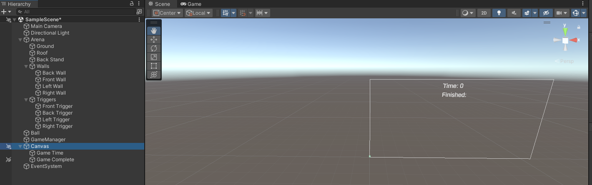

# Creating the Game

Now that you've [got used to the Unity editor](./editorOverview.md), [created some basic 3D objects](./creating3DObjects.md) and [added some input controls](./addingInputControls.md), it's time to turn the scene into a game.

The game you are going to create is very simple. It will feature an enclosed arena containing four zones (left, right, front and back), which your ball must enter as quickly as possible.

## Model the Game Arena

To model the walls and roof of the game arena, you are going to make copies of the existing ground and then _transform_ those copies so they are in the correct position. 

So, in the _Hierarchy_, right-click on "Ground" and select _copy_. Then, right-click again in the  _Hierarchy_, and select _paste_ - you will have a new _GameObject_, named "Ground (1)". Right-click on that, select _Rename_, and call it "Left Wall". Now, you need to position it so it does indeed become the left wall. The easiest way to do that is to type in values directly into the _GameObject's Transform_ in the inspector; the x and y positions should be 5, and the z rotation should be 90 degrees, just like Figure 1.  


_Figure 1: Left wall transform_

Next, repeat the process for the right wall. However, this time, the x position should be -5 and the y position should be 5. The z rotation should be -90 degrees, just like Figure 2.


_Figure 2: Right wall transform_

Then, repeat the process for the back wall. However, this time, the y position should be 5 and the z position should be -5. The x rotation should be 90 degrees, just like Figure 3.


_Figure 3: Back wall transform_

Next, the front wall. Here, you are going to take advantage of [back face culling](https://en.wikipedia.org/wiki/Back-face_culling), whereby, to preserve processing cycles, Unity will only render one side of a _GameObject_. Hence, if the wall is positioned so that the rendered side looks inward, the player will be able to see into the arena, but the ball will still rebound off the wall. To take advantage of this, the y and z positions should be 5 and the x rotation should be -90 degrees, just like Figure 4.


_Figure 4: Front wall transform_

All that remains is to repeat the process for the roof of the arena. this time, the y position should be 10 and the x rotation should be 180 degrees, just like Figure 5.


_Figure 5: Roof transform_

Now position everything so that the player is looking directly into the arena, and align the main camera with that view. 

At this point, the _Hierarchy_ is beginning to look a little unorganised, so, just as you have done for the _Project_, you should tidy up. To do so, click on your first wall in the hierarchy, then shift-click on the last wall to highlight all four walls. Then right-click > _Create Empty parent_ and call it "Walls". Next, highlights "Ground", "Roof" and "Walls", right-click > _Create Empty Parent_ and call it "Arena". 

All being well, you will have a _Hierarchy and _scene_ that looks something like Figure 6, below:


_Figure 6: Arena walls_

Now, if you press _play_ in the _Toolbar_, you should be able to move the ball using the spacebar and arrow keys and it should be impossible for the ball to escape the arena.

## Add Some Trigger Zones

To turn the arena into a game, you're going to create some trigger zones for the ball to move into, then use some more of Unity's [physics engine](./supplimentary/3DPhysics.md), via _Triggers_, to keep a track of which zones the ball enters.

First, create the front trigger zone using a _plane GameObject_. Name the object "Front Trigger", and make its transform look like that of Figure 7.


_Figure 7: Front trigger transform_

The idea here is to make the trigger zone a thin strip (its z scale is 0.1), position it at the front of the arena (its z position is 4.5) and move it so it is just off the floor (its y position is 0.001 - if you left this with a y position of zero, you might experience a phenomenon called [Z-fighting](https://en.wikipedia.org/wiki/Z-fighting), a flickering effect that happens when two or more objects are fighting to be rendered at the same position). 

Also, select the _Convex_ and _Is Trigger_ options of the "Front Triggger" Mesh Collider component in the _Inspector_, as per Figure 8.


_Figure 8: Convex trigger_

A collider that's marked as a trigger detects other colliders (but will not trigger collisions themselves). To handle the detection, you use an `OnTrigger` method in a script. So, in the scripts folder in the _Projects_ window, right click > _create > C# Script_ and call it "Zones". Then drag the script onto the "Front Trigger" in the hierarchy. Finally, double click on the script to open it in Visual Studio Code. Now, add an `OnTrigger` method, and use the `Debug.Log` trick to check that the trigger is firing whenever the ball collides with it:

```csharp
void OnTriggerEnter(Collider other)
{
    Debug.Log("In Trigger");
}
```

Save the script and return to Unity - if you've written the script correctly, when you _play_ and the ball collides with "Front Trigger", you should see "In Trigger" in the console window. If you do not see that, first check that you did not have any compilation errors. If not, then check that the script is attached as a component via the "Front Trigger" inspector. 

Next, create the left trigger zone similar to how you created the walls of the arena; copy the front trigger zone in the _Hierarchy_, rename it "Left Trigger", then make its transform look like Figure 9.


_Figure 9: Left trigger transform_

For the right trigger zone, copy the front or left trigger zones in the _Hierarchy_, rename it "Right Trigger", then make its transform look like Figure 10.


_Figure 10: Right trigger transform_

The back trigger is going to go on a stand (so the player has to use the jump interaction to activate the trigger). So, in the hierarchy, right-click > _3D Object > Cube_. Name it "Back Stand". Drag the green material onto it (to differentiate it from the trigger zones). Then make its transform look like that of Figure 11.


_Figure 11: Back stand transform_

Now, For the back trigger zone, copy the front, left or right trigger zones in the _Hierarchy_, rename it "Back Trigger", then make its transform look like Figure 12. The idea here is to place the trigger on the stand you just created above. 


_Figure 12: Back trigger transform_

You should organise the hierarchy to remove the clutter of the trigger zones. Something like Figure 13 would do that.


_Figure 13: Arena hierarchy_

Finaly, your scene should look something similar to that in Figure 14, below.


_Figure 14: Arena scene_

Now, if you press _play_ in the _Toolbar_, you should see "In Trigger" in the console window whenever the ball collides with the front, back, left or right trigger zones. 

## Set Up the Game Controls

Instead of just logging "In Trigger" in the _Console_, the "Zones" script should record that the ball has collided with its trigger. To do so, make the script look like this:

```csharp
using System.Collections;
using System.Collections.Generic;
using UnityEngine;

public class Zones : MonoBehaviour
{
    private bool hasTriggered = false;

    public bool HasTriggered
    {
        get { return hasTriggered; } 
    }

    void OnTriggerEnter(Collider other)
    {
        hasTriggered = true;
    }

}
```

The script above uses a boolean variable, `hasTriggered`, to record that its `OnTriggerEnter` method has been called. It also declares a [C# Property](https://www.w3schools.com/cs/cs_properties.php) (the `HasTriggered` method) to return the value of that variable. Additionally, the `Start` and `Update` methods have been removed, as they are not required.

## Create the Game Manager

The final script you will write manages the game. It will know about the trigger zones and will keep track of time, so that, when all four zones have been visited, it can output the total time the player took to complete that. 

To create the script, in the scripts folder in the _Projects_ window, right-click > _create > C# Script_ and call it "GameManager". Double click on the script to open it in Visual Studio Code. Below is a first draft of "GameManager", where it knows about the trigger zones and knows when the ball has visited all four, at which point, it outputs that fact to the _Console_:

```csharp
using System.Collections;
using System.Collections.Generic;
using UnityEngine;

public class GameManager : MonoBehaviour
{
    [SerializeField] private GameObject leftTrigger;
    [SerializeField] private GameObject rightTrigger;
    [SerializeField] private GameObject frontTrigger;
    [SerializeField] private GameObject backTrigger;

    private Zones leftTriggerScript;
    private Zones rightTriggerScript;
    private Zones frontTriggerScript;
    private Zones backTriggerScript;

    // Start is called before the first frame update
    void Start()
    {
        leftTriggerScript = leftTrigger.GetComponent<Zones>();
        rightTriggerScript = rightTrigger.GetComponent<Zones>();
        frontTriggerScript = frontTrigger.GetComponent<Zones>();
        backTriggerScript = backTrigger.GetComponent<Zones>();        
    }

    // Update is called once per frame
    void Update()
    {
        if (leftTriggerScript.HasTriggered &&
            rightTriggerScript.HasTriggered &&
            frontTriggerScript.HasTriggered &&
            backTriggerScript.HasTriggered)
        {
            Debug.Log("Game complete!");
        }        
    }
}
```

To make the script work, you should create an empty _GameObject_ called "GameManager" in the _Hierarchy_. Drag the script onto that, then, in the _Inspector_ for "GameManager", drag the "Left Trigger" _GameObject_ into the serialised field "Left Trigger".  Do the same for "Right Trigger", "Front Trigger" and "Back Trigger". Your scene should look solmething like Figure 15:


_Figure 15: The GameManager with the Triggers Assigned_

Now, if you press _play_ in the _Toolbar_, after you visit all four trigger zones with the ball, you should see "Game Complete!" in the _Console_. However, if you did not assign the triggers properly, your game _might__ have crashed; at the very least, it will have output lots of error messages to the _Console_. That's because the "GameManager" script does not check for null operators. There are a number of ways to fix that, but those are left as an exercise (you may wish to research C#'s [Null-Conditional Operator](https://learn.microsoft.com/en-us/archive/msdn-magazine/2014/october/csharp-the-new-and-improved-csharp-6-0#null-conditional-operator) and [Null reference types](https://learn.microsoft.com/en-us/dotnet/csharp/nullable-references)). 

Additionally, imagine you had thousands of trigger zones - in that instance, it would not be a good idea to individually reference each of them. Better would be to use lists and one of Unity's _GameObject.Find_ methods (such as [FindGameObjectsWithTag](https://docs.unity3d.com/ScriptReference/GameObject.FindGameObjectsWithTag.html)). However, again, that is left as an exercise. Besides, in the initial stages of coding a game or application, the belt and braces approach, such as that used above, is often a great starting point - the code can always be optimised later.

Now, you should introduce a timer into "GameManager". For that, you can accumulate [Time.deltaTime](https://docs.unity3d.com/ScriptReference/Time-deltaTime.html), which is he interval in seconds from the last frame to the current one and the `Update`  method, which runs once per frame. Additionally, you want to make use of a boolean variable, which checks whether the game is complete. Below are the updates to the script.

```csharp
using System.Collections;
using System.Collections.Generic;
using UnityEngine;

public class GameManager : MonoBehaviour
{
    [SerializeField] private GameObject leftTrigger;
    [SerializeField] private GameObject rightTrigger;
    [SerializeField] private GameObject frontTrigger;
    [SerializeField] private GameObject backTrigger;

    private Zones leftTriggerScript;
    private Zones rightTriggerScript;
    private Zones frontTriggerScript;
    private Zones backTriggerScript;

    private float runTime = 0;
    private bool isComplete = false;

    // Start is called before the first frame update
    void Start()
    {
        leftTriggerScript = leftTrigger.GetComponent<Zones>();
        rightTriggerScript = rightTrigger.GetComponent<Zones>();
        frontTriggerScript = frontTrigger.GetComponent<Zones>();
        backTriggerScript = backTrigger.GetComponent<Zones>();        
    }

    // Update is called once per frame
    void Update()
    {
        if (!isComplete) {    

            runTime += Time.deltaTime;
            if (leftTriggerScript.HasTriggered &&
                rightTriggerScript.HasTriggered &&
                frontTriggerScript.HasTriggered &&
                backTriggerScript.HasTriggered)
            {
                isComplete = true;
                Debug.Log("Game Complete at " + runTime.ToString("##.##"));
            }   

        }     
    }
}
```

Now, if you press _play_ in the _Toolbar_, after you visit all four trigger zones with the ball, you should see "Game Complete at (number of seconds)" in the _Console_.


## Game User Interface (UI)

The final element for the game is to output some text to the screen so that the player knows what's going on. To do that, you should introduce some text elements onto the screen, so in the _Hierarchy_ right-click > _UI > Text - TextMeshPro_; a _TMP Importer_ dialogue will appear and you should click on the _Import TMP Essentials_ button, as well as the _Import TMP Examples & Extras_ button. Then close the dialogue box. Rename the _Text (TMP) GameObject_ to "Game Time", and in its _Inspector_, change the default text from "New Text" to "Time: 0". Create another _Text - TextMeshPro GameObject_ under the _Canvas_ element, and call it "Game Complete". Change its default text to "Finished!". 

If you zoom out of the scene, you can see the whole canvas and position the two TextMeshPro _GameObjects_ on it. Figure 15 shows them positioned in the centre of the screen, above the arena.



_Figure 15: Postioned UI Elements_

Finally, you need to reference and update those objects in "GameManager", and in its _Inspector_ , drag the "Game Time" _GameObject_ into the serialised field "Time", and the "Game Complete" _GameObject_ into the serialised field "Complete". The finished script is below.

```csharp
using System.Collections;
using System.Collections.Generic;
using UnityEngine;
using TMPro;
using System;

public class GameManager : MonoBehaviour
{
    [SerializeField] private GameObject leftTrigger;
    [SerializeField] private GameObject rightTrigger;
    [SerializeField] private GameObject frontTrigger;
    [SerializeField] private GameObject backTrigger;

    [SerializeField] private TMPro.TextMeshProUGUI time;
    [SerializeField] private TMPro.TextMeshProUGUI complete;

    private Zones leftTriggerScript;
    private Zones rightTriggerScript;
    private Zones frontTriggerScript;
    private Zones backTriggerScript;

    private float runTime = 0.0f;
    private bool isComplete = false;

    private String timePreText = "Time: ";

    // Start is called before the first frame update
    void Start()
    {
        leftTriggerScript = leftTrigger.GetComponent<Zones>();
        rightTriggerScript = rightTrigger.GetComponent<Zones>();
        frontTriggerScript = frontTrigger.GetComponent<Zones>();
        backTriggerScript = backTrigger.GetComponent<Zones>(); 
        time.text = timePreText + "00.00";      
        complete.text = "";
    }

    // Update is called once per frame
    void Update()
    {
        if (!isComplete) {    

            runTime += Time.deltaTime;
            time.text = timePreText + runTime.ToString("##.##");
            if (leftTriggerScript.HasTriggered &&
                rightTriggerScript.HasTriggered &&
                frontTriggerScript.HasTriggered &&
                backTriggerScript.HasTriggered)
            {
                isComplete = true;
                complete.text = "Finished!";
            }   

        }     
    }
}
```

If you've done everything correctly, you should have a game that runs something like that shown in Figure 16, below.


_Figure 16: The finished game_

You've made substantial changes, so save the project.

The finished game may not win any design awards; furthermore, the "Game Manager" script is responsible for too much - in a real game, you would want to consider seperating game logic from UI, perhaps using an _Observer Pattern_ (which you can read about in the document on [scripting](./supplimentary/scripting.md)). However, it serves as a good introduction to building games in Unity, and it's a fine basis upon which to build. So, now you know how, go fulfill your creative urge and start building games! 

## External Links

- [Back Face Culling](https://en.wikipedia.org/wiki/Back-face_culling)
- [Z-fighting](https://en.wikipedia.org/wiki/Z-fighting)
- [Time.deltaTime](https://docs.unity3d.com/ScriptReference/Time-deltaTime.html)
- The [Unity Roll-a-ball tutorial](https://learn.unity.com/tutorial/setting-up-the-game?uv=2020.2&projectId=5f158f1bedbc2a0020e51f0d) is another nice introduction in how to move rigidbodies in a simple game. If you want to do that, create a 3D Core project and call it  "Rollaball" and then follow the Roll-a-Ball tutorial.

## Links

- [Unity 3D Pysics](./supplimentary/3DPhysics.md)
- [Scripting](./supplimentary/scripting.md)
