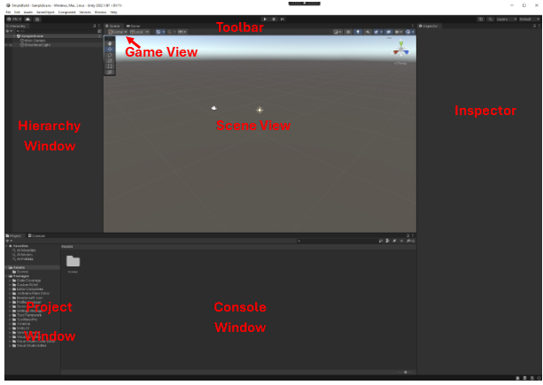

# Getting to Know the Unity 3D Editor

The organisation of the main windows might be slightly different, but you should have several key windows:

The _Scene_ View is your interactive view into the world you are creating.

The _Game_ View is rendered from the Camera(s) in your game. _Note of caution_: **if you make changes in the Game view these won’t be saved!**

The _Hierarchy_ window contains a list of every GameObject in the current Scene.

The _Inspector_ window displays detailed information about the currently selected GameObject, including all attached components and their properties, and allows you to modify the functionality of GameObjects in your Scene.

The _Console_ shows errors, warnings and other messages generated by Unity (and your scripts).