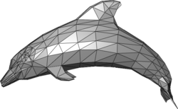

# Modelling

[Models](https://docs.unity3d.com/Manual/models.html) are files that contain data about the shape and appearance of objects used in your scenes; hence, such models could include characters, buildings, furniture, terrain, or any 3D object you could name.

Model files can contain various data, including meshes, materials and textures (they can also include animation data). [Meshes](https://docs.unity3d.com/Manual/mesh.html) are a graphics primitive that defines the shape of an object. We will look at materials and textures more closely in the next lab.

_Figure 1: A low poly triangle mesh representing a dolphin_

## Modelling and GameObjects

[GameObjects](https://docs.unity3d.com/Manual/class-GameObject.html) are pivotal to 3D modelling in Unity. They are fundamental objects in Unity and represent characters, props, scenery, and more. Every object in your game will be a GameObject.

GameObjects live in 3D environments called scenes. Scenes are primarily game levels, but they can also represent a menu, credits at the end of the game, cutscenes, or, in fact, anything!

GameObjects can be composed of many other GameObjects. And each GameObject can have one or more components. The following components are fundamental for 3D scenes in Unity:

- [Transform](https://docs.unity3d.com/Manual/class-Transform.html): the Transform component determines the Position, Rotation, and Scale of each GameObject in the scene. Every GameObject has a Transform component
- [Mesh Filter](https://docs.unity3d.com/Manual/class-MeshFilter.html): this component defines the shape of a 3D GameObject
- [Mesh Renderer](https://docs.unity3d.com/Manual/class-MeshRenderer.html): this component defines how the 3D shape defined by the Mesh Filter looks on screen
- [Cameras](https://docs.unity3d.com/Manual/class-Camera.html): specially configured GameObjects that capture and display the world to the player
- [Rigidbody](https://docs.unity3d.com/Manual/class-Rigidbody.html): Rigidbodies allow GameObjects to interact with the Physics system, including gravity and collisions
- [Colliders](https://docs.unity3d.com/Manual/CollidersOverview.html): this component defines the shape of a 3D GameObject when colliding with other GameObjects containing collider components

We will look at each of these components in the workshop.

## Importing 3D Models from Other Software

If you create some 3D models in a tool like [Blender](https://www.blender.org/), you should export them in the [Filmbox (.fbx)](https://en.wikipedia.org/wiki/FBX) file model format since that's the format Unity supports directly. You can also use other model formats, but under the hood, Unity will convert them to fbx (and not always get everything correct), so .fbx is often the best choice. To import your third-party exported models, copy them into your Assets folder in your Unity project.

## World-building in the Unity Editor

[ProBuilder](https://unity3d.com/unity/features/worldbuilding/probuilder) is a world-building package tool you can add to Unity. It is a hybrid 3D modelling and level design tool, allowing you to create, edit and texture complex geometry within the Unity Editor. That means you do not necessarily need to use a tool like Blender to create your 3D models; instead, you can use ProBuilder to design structures and complex terrain features or to make custom collision geometry and triggers.

Please note that it is beyond the scope of this workshop to support ProBuilder or external tools like Blender.  

## External Links

- [Models](https://docs.unity3d.com/Manual/models.html)
- [Meshes](https://docs.unity3d.com/Manual/mesh.html)
- [GameObjects](https://docs.unity3d.com/Manual/class-GameObject.html)
- [Transform](https://docs.unity3d.com/Manual/class-Transform.html)
- [Mesh Filter](https://docs.unity3d.com/Manual/class-MeshFilter.html)
- [Mesh Renderer](https://docs.unity3d.com/Manual/class-MeshRenderer.html)
- [Cameras](https://docs.unity3d.com/Manual/class-Camera.html)
- [Rigidbody](https://docs.unity3d.com/Manual/class-Rigidbody.html)
- [Colliders](https://docs.unity3d.com/Manual/CollidersOverview.html)

## Links

- [Coordinate Systems](./maths/coordinateSystems.md)
- [Graphics Background](../graphicsBackground.md)
